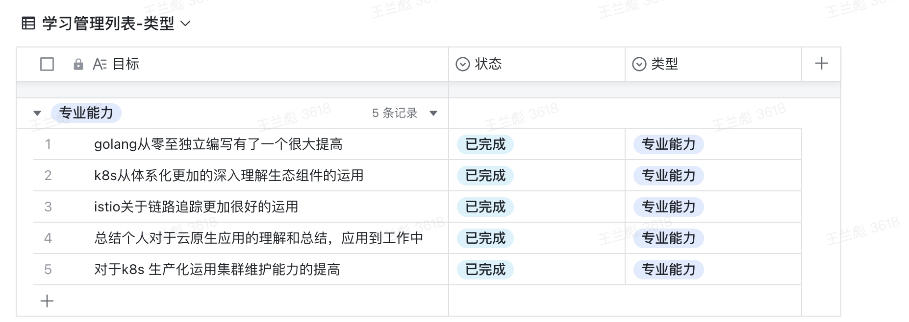

#####个人学习目标

	📈 锲而舍之，朽木不折；锲而不舍，金石可镂。 

####学习目标
	主要针对相关技术点总结一下吧

####学习心得
      云原生不只是一系列技术的组合，而是一套方法论，包括容器化、微服务、devops、持续交付等，核心是通过优化应用的架构设计、流程部署、运维方式，让项目工程管理和基础设施变的更加高效和自治；
  
      
     孟老师讲了很多k8s生态系统相关的细节和流程方面，赶紧自己还是缺少很多，不过还是坚持了下来；边学习边总结，让自己在这方面更加的提高一个层面，从而也想了很多总结出云原生的优势所在；
  
     
     针对云原生，后面的工作主要还是针对四化进行建设，让云原生+k8s生态更加的异彩，总而高效率工作；
	  感谢老师，🙏