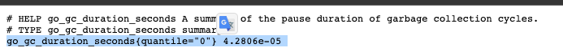

# go_lear

#docker registry 一般使用内部仓库 这里就不写了。 docker push  XXXX:v0.0.1 开发权限即可

#本地镜像编辑：docker build -t golear_test:v0.0.1 .

3、将 HTTPServer 部署至测试集群，并完成 Prometheus 配置；
这个镜像为：0.0.3 版本上传至内部集群；

metrics信息： 
4、本地查询
